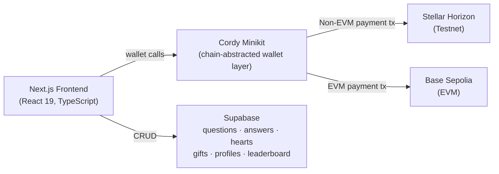

# AskVerse

**Wallet-connected Q&A platform where good answers get gifted, not just liked.**

AskVerse lets communities ask questions, share answers, and reward the most helpful responses with real XLM — turning knowledge-sharing into something tangible. Built for the APAC Stellar Hackathon under the **Payment & Consumer Applications** track.

[Live Demo](https://askverse-pi.vercel.app/) · [Video Demo](https://drive.google.com/file/d/1NMawIzTk_0krOAeY8xzMi5ykWmgvEO3d/view?usp=sharing) · [Pitch Deck](https://canva.link/qnrbb2f8ll3fq7l)

---

## Focus Area: Payment & Consumer Applications

AskVerse is a consumer-facing payment tool disguised as a Q&A app. The core loop — ask, answer, gift, rank — turns Stellar's fast, low-fee rails into an everyday reward mechanism anyone can use without needing to understand blockchain first. A user connects a wallet, browses questions like they would on any forum, and can tip a helpful answer in XLM in a couple of taps. That's the accessible, real-world payment experience this track calls for.

## The Problem

Good answers online routinely go unrewarded. Upvotes and hearts feel good but carry no real value, so there's little incentive for people to share deep, useful knowledge — especially in communities (students, local business owners, hobbyists) where expertise is often given away for free. AskVerse closes that gap by letting anyone reward useful answers with a real XLM gift, instantly and without a payment processor in between.

## How It Works

1. **Ask** — post a question with a title and detailed body.
2. **Answer** — community members respond.
3. **Heart** — react to posts you find useful.
4. **Gift** — send XLM directly to an answer that helped you.
5. **Rank** — the leaderboard tracks total gifted score, surfacing the most valuable contributors.

Rewards aren't auto-minted — they're peer-funded. The leaderboard reflects real value transferred, not just popularity.

## Tech Stack

| Layer | Tech |
|---|---|
| Framework | Next.js 16, React 19, TypeScript |
| Styling | CSS Modules |
| Data | Supabase |
| State/Data-fetching | TanStack Query |
| Wallet / Chain Abstraction | [Cordy Minikit](https://www.npmjs.com/package/@cordystackx/cordy_minikit) (CordyStackX) |
| Stellar | Testnet, Horizon API |
| EVM | Base Sepolia |

## Architecture



Cordy Minikit handles wallet connection and Stellar payment calls to Horizon; Supabase stores app state (posts, gift records, leaderboard scores) and keeps score reconciliation off-chain for speed, while the actual value transfer happens on-chain via XLM.

## Contract Addresses

### Stellar / Soroban Mainnet ✅ Live

```env
NEXT_PUBLIC_STELLAR_HORIZON=https://horizon.stellar.org
NEXT_PUBLIC_STELLAR_CONTRACT_ID=CDVKB2ZBU6LRQKVTTNKHSVF23UGTKVP4PKCXHOQ3MWO3XQIXB5DTYJ5K
NEXT_PUBLIC_STELLAR_NETWORK_PASSPHRASE=Public Global Stellar Network ; September 2015
```

[View on Stellar Expert](https://stellar.expert/explorer/public/contract/CDVKB2ZBU6LRQKVTTNKHSVF23UGTKVP4PKCXHOQ3MWO3XQIXB5DTYJ5K)

### Stellar / Soroban Testnet

```env
NEXT_PUBLIC_STELLAR_HORIZON=https://horizon-testnet.stellar.org
NEXT_PUBLIC_STELLAR_CONTRACT_ID=CBHL6LZVEVKGNEGDX6VZ2PP2VIQZOU3QRYLNZHJBRBMLWHBYW5UINFDJ
NEXT_PUBLIC_STELLAR_NETWORK_PASSPHRASE=Test SDF Network ; September 2015
```

### EVM — Base Sepolia

```env
NEXT_PUBLIC_RPC_ENDPOINT=https://sepolia.base.org
NEXT_PUBLIC_TOKENADDRESS=0x7E0A673a70eC87C0a16370929280da2483703e62
NEXT_PUBLIC_WALLETCONNECT_PROJECT_ID=67d2d578d855e579911095f9db6d4b29
```

## Features

- Ask questions with a title and detailed body
- Browse, search, and filter the community feed
- Answer questions from other users
- Heart posts in the feed
- Send XLM gifts to helpful answers
- Track profile balance and total up-vote score
- Edit display name and username
- View leaderboards for top answer creators
- Connect EVM and non-EVM wallets through Cordy Minikit

## App Routes

| Route | Description |
|---|---|
| `/` | Landing page |
| `/auth/sign-in` | Wallet sign-in |
| `/home` | Main Q&A feed |
| `/leader_boards` | Top users by gifted answer score |

## API Routes

| Route | Purpose |
|---|---|
| `/services/supabase/auth` | Create or authenticate user profile |
| `/services/supabase/retrieve` | Retrieve user profile |
| `/services/supabase/update` | Update profile |
| `/services/supabase/post` | Create a question |
| `/services/supabase/retrieve_post` | Retrieve questions and answers |
| `/services/supabase/answer` | Submit an answer |
| `/services/supabase/hearts` | Toggle post hearts |
| `/services/supabase/upvote` | Record gifted answer score |
| `/services/supabase/health` | Health check |

## Getting Started

### Prerequisites
- Node.js 18+
- npm (or pnpm)
- A Supabase project
- A Stellar testnet-funded wallet (for testing gifts)

### Installation

```bash
git clone https://github.com/LCCB-SIPD/askverse.git
cd askverse
npm install
```

### Environment Setup

Create `.env.local`:

```env
NEXT_PUBLIC_SUPABASE_URL=
NEXT_PUBLIC_SUPABASE_ANON_KEY=
NEXT_PUBLIC_SUPABASE_PUBLISHABLE_KEY=

SUPABASE_URL=
SUPABASE_SERVICE_ROLE_KEY=
SUPABASE_ANON_KEY=
SUPABASE_PUBLISHABLE_KEY=

NEXT_PUBLIC_RPC_ENDPOINT=
NEXT_PUBLIC_TOKENADDRESS=
NEXT_PUBLIC_WALLETCONNECT_PROJECT_ID=

NEXT_PUBLIC_STELLAR_HORIZON=
NEXT_PUBLIC_STELLAR_CONTRACT_ID=
NEXT_PUBLIC_STELLAR_NETWORK_PASSPHRASE=
```

### Run Locally

```bash
npm run dev
```

Open [http://localhost:3000](http://localhost:3000).

### Scripts

```bash
npm run dev      # start dev server
npm run lint      # lint codebase
npm run build     # production build
npm run start     # run production build
```

## Roadmap

- [x] Mainnet deployment on Stellar
- [ ] Soroban smart contract integration for on-chain gift/score verification (`askverse_gifts` contract in progress)
- [ ] Notifications for gifted answers
- [ ] Mobile-responsive polish
- [ ] Expanded moderation tools for community feeds

## Team

**Marc Giestin Louis Cordova** ([CordyStackX](https://github.com/CordyStackX)) — Founder & Lead Developer
Designed and developed the platform; built the frontend and backend routes; integrated wallet connection; implemented question, answer, gift, profile, and leaderboard flows.

## Links

- **Repository:** https://github.com/LCCB-SIPD/askverse.git
- **Live Demo:** https://askverse-pi.vercel.app/
- **Video Demo:** https://drive.google.com/file/d/1NMawIzTk_0krOAeY8xzMi5ykWmgvEO3d/view?usp=sharing
- **Pitch Deck:** https://canva.link/qnrbb2f8ll3fq7l
- **Github:** https://github.com/cordystackx
- **XTwitter:** https://x.com/cordystackx
- **LinkedIn:** www.linkedin.com/in/marc-giestin-louis-cordova-657849276
- **Telegram:** https://t.me/cordystackx

## License

MIT

---

## Screenshots

### Landing & Auth

| Landing Page | Login |
|---|---|
|  |  |

| Connect Wallet | Connect Wallet (Step 2) |
|---|---|
|  |  |

### Core App

| Home Feed | Post a Question |
|---|---|
|  |  |

| Submit an Answer | Leaderboard |
|---|---|
|  |  |

### Gifting

| Gift Flow | Gift Flow (Step 2) |
|---|---|
|  |  |

### Account

